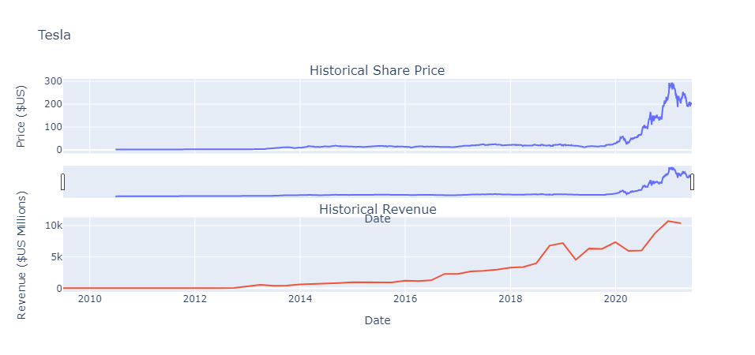
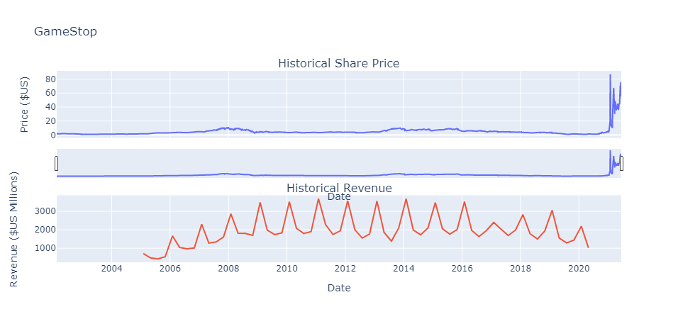
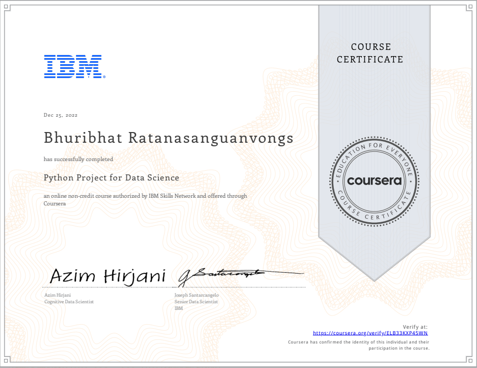

# Python Project for Data Science

## 📄 Summary 
This course is intended to demonstrate foundational Python skills for working with data. The completion of this course involves working on a hands-on project developing a dashboard using Python.

## 📑 Main Topics 
- [Extracting Stock Data Using the yfinance library](https://github.com/Bhuribhat/IBM-Data-Science/blob/main/5.%20Python%20Project%20for%20Data%20Science/Extracting_Stock_Data_Library.ipynb)
- [Extracting Stock Data Using Web Scraping](https://github.com/Bhuribhat/IBM-Data-Science/blob/main/5.%20Python%20Project%20for%20Data%20Science/Extracing_Stock_Data_Webscraping.ipynb)
- [Analyzing Historical Stock/Revenue Data and Building a Dashboard](https://github.com/Bhuribhat/IBM-Data-Science/blob/main/5.%20Python%20Project%20for%20Data%20Science/Final%20Assignment.ipynb)

  
  

## 🔑 Key Skills Learned 
- Data extraction using the yfinance library
- Webscraping using the BeautifulSoup library
- Data Analysis
- Dashboard creation

## 🏆 Certificates 
To verify the certificates, click the images to follow the links.

  

