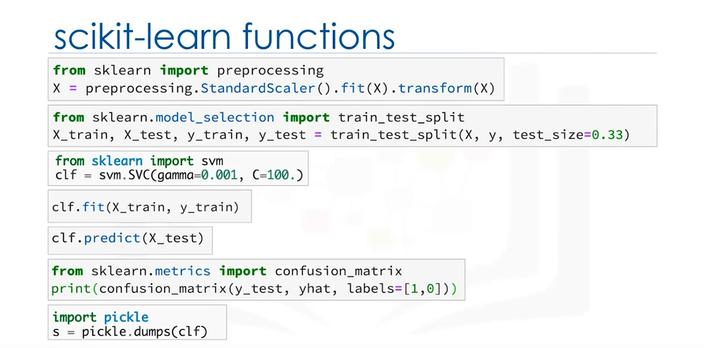
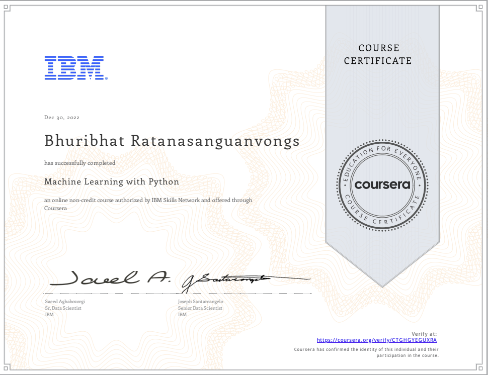

# Machine Learning with Python

## 📄 Summary 
This course provides an overview of the purpose of Machine Learning, and where it applies to the real world. It then covers topics such as supervised vs unsupervised learning, model evaluation, and various useful Machine Learning algorithms. 

To explore the methods of machine learning, and the algorithms involved, many example projects are embarked upon and explored, including cancer detection, predicting economic trends, predicting customer churn, and recommendation engines. 

The [final project](https://github.com/Bhuribhat/IBM-Data-Science/tree/main/9.%20Machine%20Learning/Week%205%20-%20Final%20Project) within this course is the building of a classifier to predict whether a loan case will be paid off. It is a classification problem, and KNN, Decision Tree, SVM, and Logistic Regression are all used to determine the best algorithm to use.

## 📑 Main Topics
- [Introduction to Machine Learning](https://github.com/Bhuribhat/IBM-Data-Science/tree/main/9.%20Machine%20Learning/Week%201%20-%20Intro%20to%20Machine%20Learning)
  - Examples of machine learning in various industries
  - The steps machine learning uses to solve problems
  - Examples of techniques and Python libraries used 
  - Differences between Supervised and Unsupervised algorithms
- [Regression](https://github.com/Bhuribhat/IBM-Data-Science/tree/main/9.%20Machine%20Learning/Week%202%20-%20Regression)
  - Simple linear regression
  - Multiple linear regression
  - Non-linear regression
  - Evaluating regression models
- [Classification](https://github.com/Bhuribhat/IBM-Data-Science/tree/main/9.%20Machine%20Learning/Week%203%20-%20Classification)
  - Comparisons between the different classification methods
  - K Nearest Neighbours (KNN)
  - Decision Trees
  - Regression Trees
  - Logistic Regression
  - Support Vector Machines (SVM)
  - Multiclass Prediction
- [Clustering](https://github.com/Bhuribhat/IBM-Data-Science/tree/main/9.%20Machine%20Learning/Week%204%20-%20Clustering)
  - k-Means Clustering
  - Hierarchical Clustering
  - Density Based Clustering

## 🔑 Key Skills Learned 
- Understanding of various Machine Learning models, such as Regression, Classification, Clustering, and Recommender Systems
- Use of Python for Machine Learning (including Scikit Learn)
- Application of Regression, Classification, Clustering, and Recommender Systems algorithms on various datasets to solve real world problems

## 🏆 Certificates 
To verify the certificates, click the images to follow the links.

  

