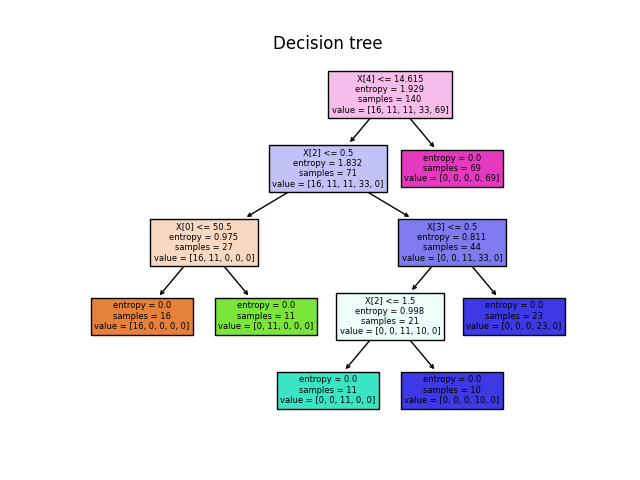
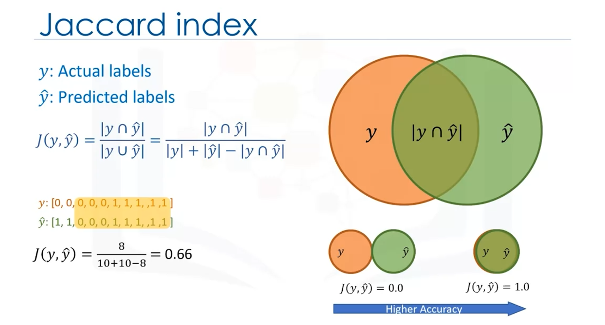
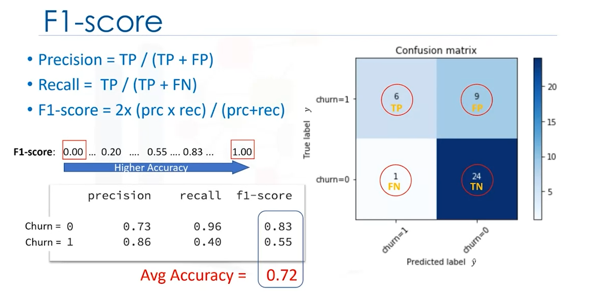
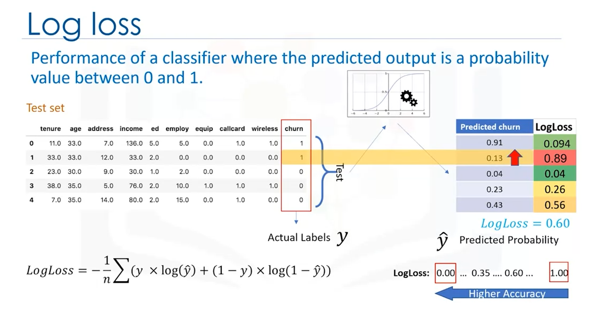

# Classification

## Definition
In machine learning, classification is a supervised learning approach which can be thought of as a means of categorizing or classifying some unknown items into a discrete set of classes. Classification attempts to learn the relationship between a set of feature variables and a target variable of interest. The target attribute in classification is a categorical variable with discrete values. Given a set of training data points along with the target labels, classification determines the class label for an unlabeled test case. 

## Use Cases

### Binary Classification
A good example of classification is the loan default prediction. Suppose a bank is concerned about the potential for loans not to be repaid. If previous loan default data can be used to predict which customers are likely to have problems repaying loans, these bad risk customers can either have their loan application declined or offered alternative products. The goal of a loan default predictor is to use existing loan default data which has information about the customers such as age, income, education, etc., to build a classifier, pass a new customer or potential future default to the model, and then label it, i.e the data points as defaulter or not defaulter. This is how a classifier predicts an unlabeled test case. Note that this specific example is a a binary classifier with two values. 

### Multi-Class Classification
Classifier models can be built for both binary classification and multi-class classification. For example, imagine that you've collected data about a set of patients, all of whom suffered from the same illness. During their course of treatment, each patient responded to one of three medications. You can use this labeled dataset with a classification algorithm to build a classification model. Then you can use it to find out which drug might be appropriate for a future patient with the same illness. 

### Churn Detection and Other Applications
Classification can also be used to predict the category to which a customer belongs, for churn detection where we predict whether a customer switches to another provider or brand, or to predict whether or not a customer responds to a particular advertising campaign. Data classification has several applications in a wide variety of industries. Essentially, many problems can be expressed as associations between feature and target variables, especially when labelled data is available. This provides a broad range of applicability for classification. For example, classification can be used for email filtering, speech recognition, handwriting recognition, biometric identification, document classification and much more. 

## Module Scope
This module will consider some of the many types of classification algorithms, such as decision trees, k-nearest neighbor, logistic regression, and support vector machines. There are many types of classification algorithms. 

### K-Nearest Neighbours Algorithm
1. Pick a value for K.
2. Calculate the distance of unknown case from all cases.
3. Select the K-observations in the training data that are "nearest" to the unknow data point.
4. Predict the response of the unknown data point using the most popular response value from KNN.

### Decision Tree

#### Train Dataset
- Each `internal node` corresponds to a test
- Each `branch` corresponds to a result of the test
- Each `leaf node` assigns a classification

#### Algorithm
1. Choose the `best` attribute from your dataset that `increases purity` in the tree nodes.
2. Calculate the significance of attribute in splitting of data.
3. Split data based on the value of the best attribute.
4. Go to step 1 and repeat.

### Regression Tree
As we have already seen, decision trees can be used for classification, but we can also use them for regression, commonly called regression trees.   

The basic idea behind regression trees is to split our data into groups based on features, like in classification, and return a prediction that is the average across the data we have already seen.  

The way the trees are built are similar to classification, but instead of using the **entropy** criterion. In Classification Trees, we choose features that increase the **information gain**. In Regression Trees, we choose features that minimize the error.  

## Evaluation Metrics in Classification
Evaluation metrics explain the performance of a model. We have trained the model, and now we want to calculate its accuracy using the test set. We pass the test set to our model, and we find the predicted labels. Both Jaccard and F1-score can be used for multi-class classifiers.

### Jaccard index

### F1-score

### Log Loss
