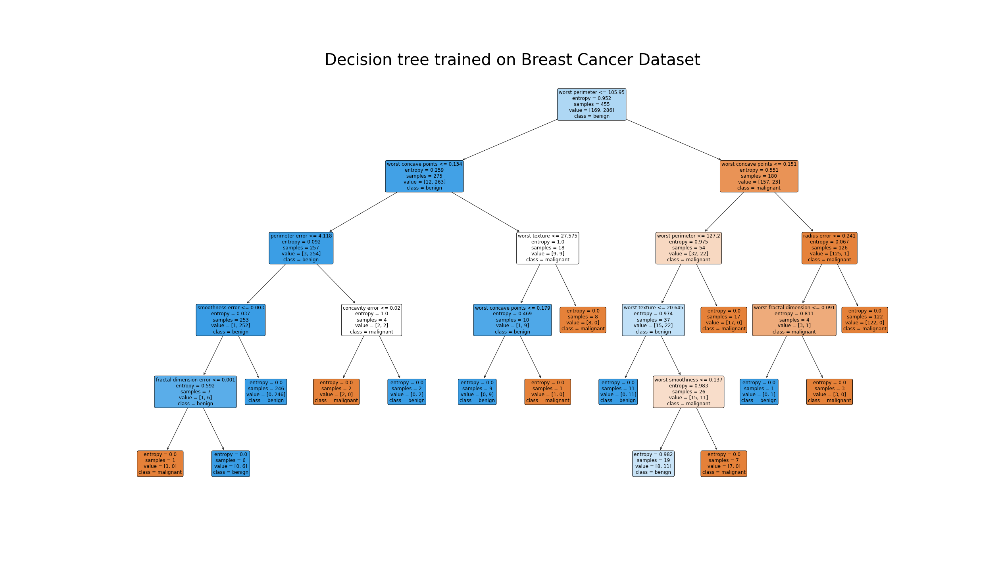

# Breast Cancer

breast cancer dataset from **sklearn** library.

- malignant: cancer
- benign: not cancer


## Predict with your own data

```py
import pickle
import numpy as np
import pandas as pd


# load trained model to use with your data
def load_model():
    return pickle.load(open("./assets/model.pkl", "rb"))


# load model
TREE = load_model()

# load dataframe
DF = pd.read_csv("./assets/cancer.csv")

# get feature names
feature_names = DF.columns[:-1]
features = np.ones((1, len(feature_names)))

# user input
for i, name in enumerate(feature_names):
    min_val = DF[name].min()
    max_val = DF[name].max()

    # print range for each features
    print(f"{i + 1:02}.) {name} = [{min_val:.2f}, {max_val:.2f}]")
    data = input(f"Enter your {name}: ").strip()
    features[0, i] = data if data else DF[name].mean()

# input : 2D array (1, 30)
features = features.astype(np.float64)
prediction = TREE.predict(features)

# output : 2D array
if prediction[0] == 0:
    print("\nMalignant, You got a cancer.")
else:
    print("\nBenign, You have no cancer.")
```

## Decision Tree

