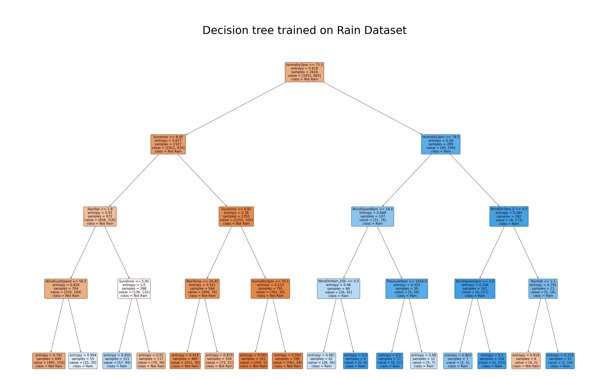

# Machine Learning with Python - The Best Classifier

## 📄 Summary
This project involved completing a notebook to build a classifier that predicts whether there will be rain the following day.

## 📝Method
For your project, you will use a rainfall dataset from Australian Government's Bureau of Meteorology , clean the data, and apply different classification algorithm on the data.  

Tthe following classification algorithms are trained using the training data, and the corresponding scikit learn libraries:

1. Linear Regression
2. KNN
3. Decision Trees
4. Logistic Regression
5. SVM

The results are reported as the accuracy of each classifier, using the following metrics:
1. Accuracy Score
2. Jaccard Index
3. F1-Score
4. LogLoss
5. Mean Absolute Error
6. Mean Squared Error
7. R2-Score

